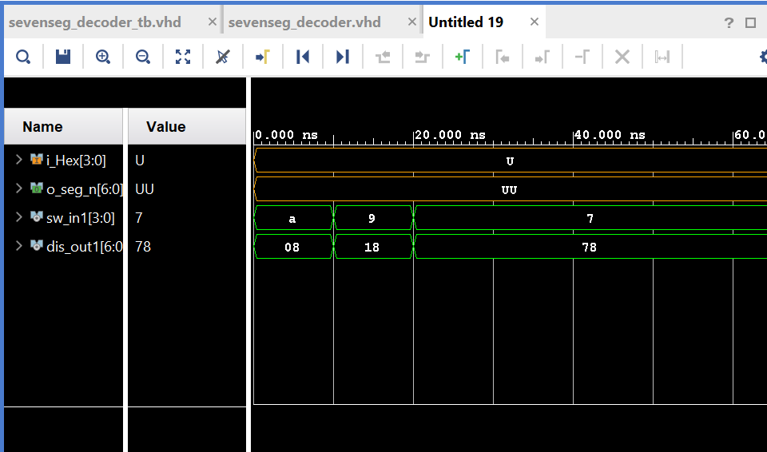

# Lab 2: Seven Segment Display Decoder

VHDL for ECE 281 [Lab 2](https://usafa-ece.github.io/ece281-book/lab/lab2.html)

Targeted toward Digilent Basys3. Tested Vivado 2024.2
DOC: Recieved help from online reasources as well as EI with Capt Yarbrough

